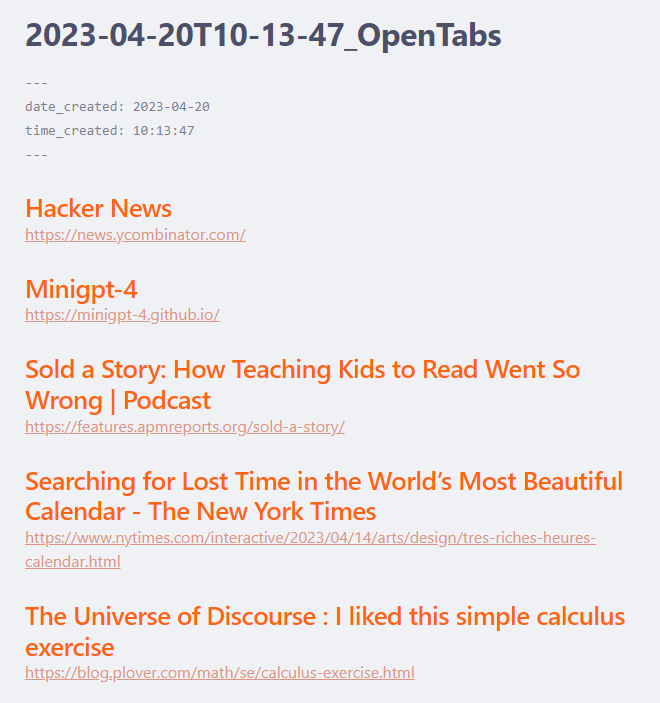

# TabSidian

TabSidian is a Microsoft Edge browser extension that helps users easily generate an Obsidian-compatible markdown file containing a list of their open tabs. The extension filters out pre-defined restricted URLs, such as settings and pinned tabs, and organizes the remaining tabs with their titles and URLs in a markdown format.

## Table of Contents

- [Installation](#installation)
- [Usage](#usage)
- [Tips](#tips)
- [Sample Output](#sample-output)
- [Limitations](#limitations)
- [Author](#author)
- [Built With](#built-with)
- [Contributing](#contributing)

## Installation

To install TabSidian, follow these steps:

1. Download the source code as a ZIP file or clone the repository using Git.
2. Extract the downloaded ZIP file to a folder on your local machine.
3. Open Microsoft Edge and navigate to `edge://extensions`.
4. Enable "Developer mode" by toggling the switch in the lower-right corner of the Extensions page.
5. Click on the "Load unpacked" button and select the folder containing the extracted source code.
6. TabSidian should now be installed and visible in your extensions list.

## Usage

1. Click on the TabSidian extension icon in the toolbar.
2. The extension will process all open tabs (excluding restricted URLs) and generate a markdown file.
3. A download prompt will appear, allowing you to save the generated markdown file to your local storage.
4. Import the markdown file into Obsidian or any other markdown-compatible application for further use.
5. You may add more restricted URLs by right-clicking the extension icon and opening the Options page.

## Tips

1. Create a folder in your Obsidian vault to store all the markdown files generated by tabSidian.
2. Pin this folder to Quick Access for easier access when saving the files.

## Sample Output

The generated markdown file will have a format similar to the following:

---
date_created: 2023-04-11
time_created: 16:58:42
---

## Tab Title 1
[https://example1.com](https://example1.com)

## Tab Title 2
[https://example2.com](https://example2.com)

## Limitations

1. tabSidian only works on the active window. If you have many browser windows open with many tabs in each one, you will need to process each browser window individually.
2. Due to restrictions on extensions, tabSidian cannot automatically save the file for you (or even open the right folder every time).

## Author

- Carlos Granier
- [cgranier](https://github.com/cgranier)
- [cgranier](https://twitter.com/cgranier)

- GPT-4
- [GPT-4](https://chat.openai.com/)

## Built With

- HTML
- CSS
- JavaScript

## Contributing

1. Fork the repository on GitHub.
2. Clone the forked repository to your local machine.
3. Create a new branch for your feature or bugfix.
4. Make your changes, and ensure that your code is well-organized and documented.
5. Commit your changes, and push them to your forked repository.
6. Create a pull request to the original repository, providing a clear and concise description of your changes.

Please follow the code style and structure already present in the project and make sure to test your changes before submitting a pull request.
